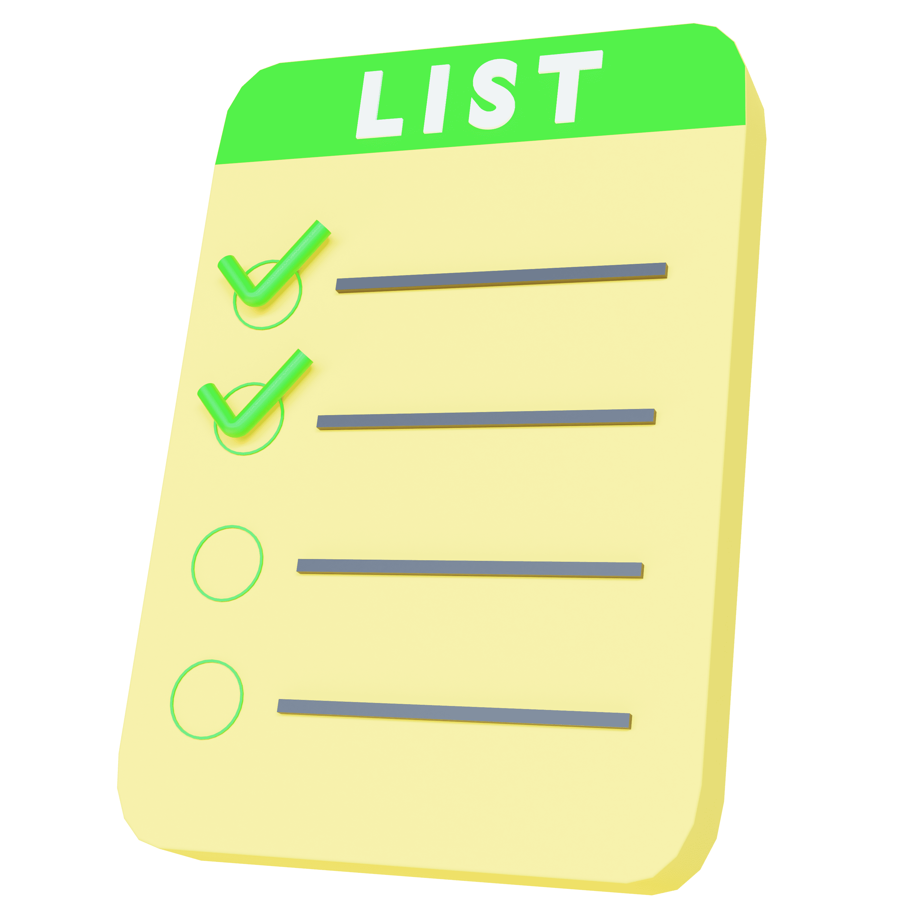
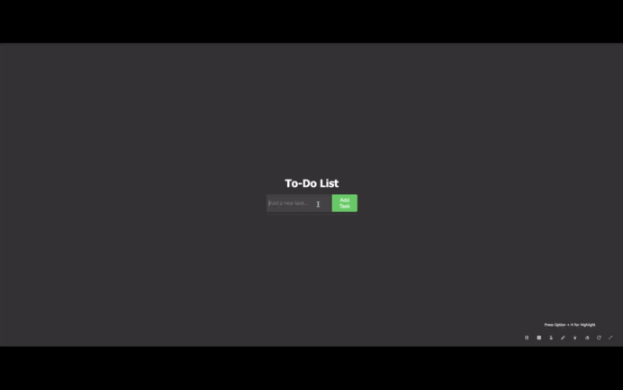

<a name="readme-top"></a>

 
<!-- PROJECT LOGO -->
<br />
<div align="center">
  <a href="https://github.com/ibrsec/todo-app/">
    
  </a>

  <h3 align="center">To do App</h3>

  <p align="center">
    An awesome To DO App Project
    <a href="https://github.com/ibrsec/todo-app"><strong>Explore the docs »</strong></a>
    <br />
    <br />
    <a href="https://todo-app-tau-rose.vercel.app/">View Demo</a>
    ·
    <a href="https://github.com/ibrsec/todo-app/issues">Report Bug</a>
    ·
    <a href="https://github.com/ibrsec/todo-app/issues">Request Feature</a>
  </p>
</div>


<!-- TABLE OF CONTENTS -->
<details>
  <summary>Table of Contents</summary>
  <ol>
    <li><a href="#about-the-project">About The Project</a></li>
     <!-- <li><a href="#figma">Figma</a></li> -->
     <li><a href="#project-skeleton">Project Skeleton</a></li>
     <li><a href="#built-with">Built With</a></li>
    <!-- <li>
      <a href="#getting-started">Getting Started</a>
      <ul>
        <li><a href="#prerequisites">Prerequisites</a></li>
        <li><a href="#installation">Installation</a></li>
      </ul>
    </li>
    <li><a href="#usage">Usage</a></li>
    <li><a href="#roadmap">Roadmap</a></li>
    <li><a href="#contributing">Contributing</a></li>
    <li><a href="#license">License</a></li>
    <li><a href="#contact">Contact</a></li>
    <li><a href="#acknowledgments">Acknowledgments</a></li> -->

    
  </ol>
</details>


---

<!-- ABOUT THE PROJECT -->
## About The Project

[](https://todo-app-tau-rose.vercel.app/)


<p align="left">
<ul>
  <li>Add Task : [Enter] or Add Task button</li>
  <li>Delete   : [Delete] or x button</li>
</ul>
</p>


<p align="right">(<a href="#readme-top">back to top</a>)</p>

<!-- 
---

## Figma 

<a href="https://www.figma.com/file/ePyCHKsx2ODB32uLgyUEEd/bootstrap-home-page?type=design&node-id=0%3A1&mode=design&t=edDzadCB9Ev5FS1a-1">Figma Link</a>  

  <p align="right">(<a href="#readme-top">back to top</a>)</p> -->


---

## Project Skeleton 

```
Google-Learning (folder)
|
|----style.css       
|----img (folder)           
|----index.html
|----readme.md
```

<p align="right">(<a href="#readme-top">back to top</a>)</p>

---

### Built With

 
<!-- https://dev.to/envoy_/150-badges-for-github-pnk  search skills-->

 
  
  
 <!--   -->
 


<p align="right">(<a href="#readme-top">back to top</a>)</p>


